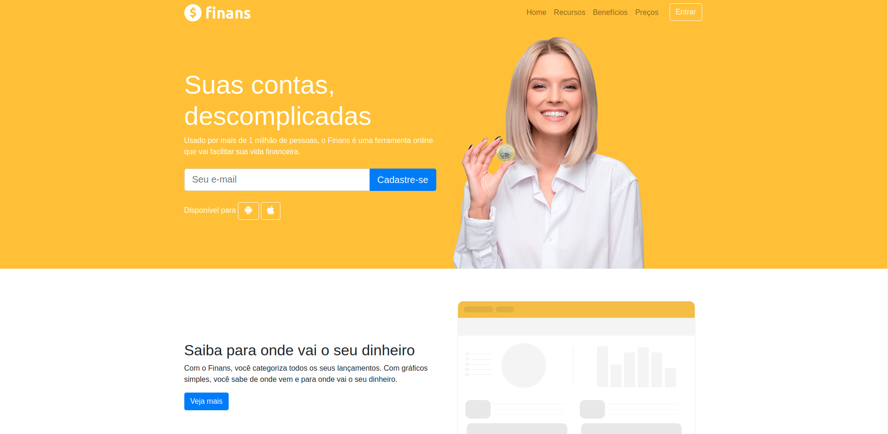
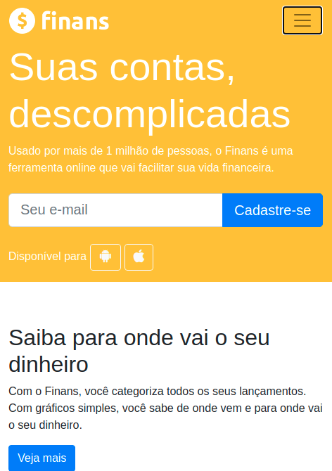

# Projeto Finans

O projeto Finans é um projeto que realizei onde o desafio era criar uma home de um site de finanças.

O projeto Finans é na verdade, um site de finanças fictício, e o projeto foi realizado apenas com o intuíto de praticar a utilização do HTML/CSS com a ajuda do Bootstrap.

<h1>Responsividade</h1>
Com o Bootstrap implementado, o projeto se tornou uma ótima oportunidade para que eu treinasse as funções de layouts responsivos, e as suas filosofias de "Mobile first". 

 
 
<h1>Cŕeditos</h1>
O projeto foi realizado com a ajuda do professor Jamilton Damasceno e seu curso sobre desenvolvimento web completo na plataforma da Udemy.
